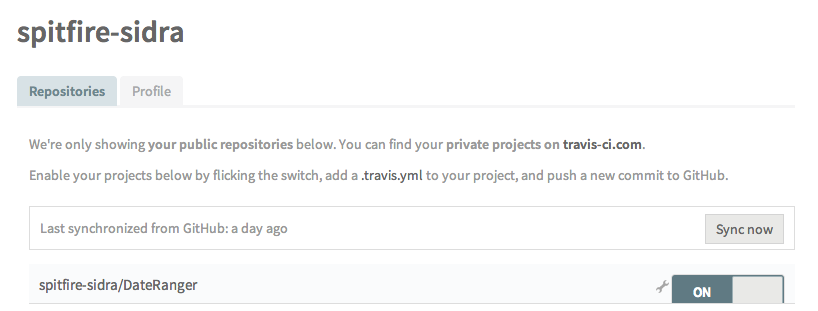
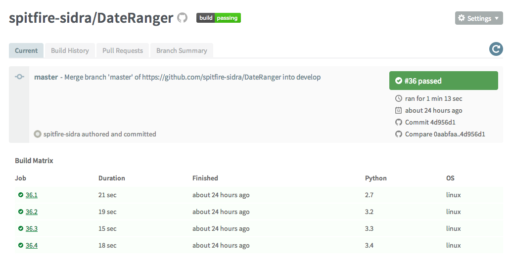
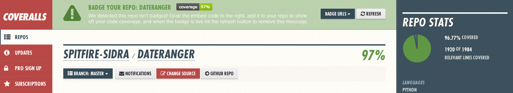

# 少年 Py 的奇幻漂流

## 前言

在「學徒模式:優秀軟體開發者的養成之路」這本書中，提到了不少個成為優秀軟體開發者所必須實踐的幾個原則，本文是基於「記錄個人所學」、「打造拋棄式玩具」、「分享所學」這 3 個原則而寫成的。

如同「少年 PI 的奇幻漂流」中的 3 個故事，本文也以 3 個主要過程來陳述利用 GitHub, Travis CI, Coveralls.io, PyPi 打造 Python 套件的過程與心得，希望能夠幫助更多人得到成長，不過編者也不是相當有經驗的人，如果有誤解，也請多多指教。

此 Python 套件名為 DateRanger，主要是寫來計算常用的商用日期區間。目前原始碼放在 GitHub 上，同時也可以透過 PyPi 安裝，如果有任何問題或者建議也歡迎在 GitHub 與編者反映。

    PyPi: <https://pypi.python.org/pypi/DateRanger>

    GitHub: <https://github.com/spitfire-sidra/DateRanger>

## 開發的第一步 - 檢視你的需求＆打造原型

在編者的日常工作中，經常需要利用當前日期往回推算日期區間，以產生對應的數據報表，甚至一些監控的系統也需要類似的日期區間去產生對應的監控數據，每次都去翻月曆查幾號到幾號實在是相當的重複自己(repeat myself)，所以編者決定打造一個小小的拋棄式玩具，可以自動推算日期區間，以讓自己達到偷懶的目的！

所以編者檢視了自己的需求，發覺自己需要類似以下的功能來幫助自己：

```
>>> date_range = DateRanger()
>>> yesterday = date_range.prev_day(n=1)
# expect datetime.date(2015, 1, 1)
>>> last_week = date_range.prev_week(n=1)
# datetime.date(2014, 12, 28) to datetime.date(2015, 1, 3)
>>> last_month = date_range.prev_month(n=1)
...(略)...
```

因此，編者就開始打造了一些很簡略的原型試著驗證自己的想法，例如：

```
class DateRanger(object):

    def __init__(self, base_date=None):
        self.base_date = base_date or date.today()
    
    def pre_day(self, days=1):
        pass

    def pre_week(self, weeks=1):
        pass
...(略)...
```

接下來，就搭配 Git 版本控制與 GitHub 來慢慢將原型發展成比較有規劃的樣子。而 Git 與 GitHub 的教學在網路上也已經多不勝數，因此就不再贅述。

但大家如果有興趣的話，可以看編者整理的[教學](https://github.com/spitfire-sidra/git-tutorial)

再來，編者的第二個需求是希望能夠將此一套件開放原始碼，讓每個人都能夠受惠。

所以最主要的部分就是必須將原本編者隨性的資料夾結構改成 pip 所規範的結構，以方便打包(packaging)。

基本的結構如下：

```
YOUR_PACAKGE_NAME/
├── YOUR_PACAKGE_NAME/
│   ├── __init__.py
│   └── test/
│        └── __init__.py
├── LICENSE.txt
├── MANIFEST.in
├── README.rst
├── setup.cfg
└── setup.py
```

檔案與資料夾用途說明：

* `LICENSE.txt` 開放原始碼授權條款
* `README.rst` 文件說明(必須以 reStructuredText 語法撰寫，目前 PyPi 不支援 Markdown 語法)
* `setup.py` 寫明套件的基本資訊與簡介，例如作者聯絡資訊(請不要寄垃圾信給我XD)，以及需要被打包的模組或者模組相依性
* `setup.cfg` 寫明一些setup相關設定或者metadata
* `MANIFEST.in` 除了模組之外，額外需要被打包的檔案，例如 `README.rst` 就需要放在這裡

更多的說明與教學詳見文件： <https://python-packaging-user-guide.readthedocs.org/en/latest/>

### 小結

這就是少年 Py 的第 1 個故事。看起來似乎很容易，但寫程式的過程也來回修改了很多次，這一切其實是肇因於編者並沒有定義比較清楚的規格，例如到底一周的結束是結束在週六好呢？還是週日？這樣問題就會影響一些方法實作，與後續的測試設計與實作。

這個過程還是告訴我們，除了原型之外，清楚的規格也是很重要的，才不會讓我們花太多時間在對付因為沒有定義規格而造成的實作上的模凌兩可。

“原型讓你看見可能性，規格為你消除不確定性。”

再來是文件還是需要先花點時間閱讀的，例如：筆者在測試利用 `pip` 安裝套件時是不是正常時就遇到了這樣的問題：

```
$ pip install DateRanger
Downloading/unpacking DateRanger
  Running setup.py egg_info for package DateRanger
    Traceback (most recent call last):
      File "<string>", line 14, in <module>
      File "/home/.../build/DateRanger/setup.py", line 15, in <module>
        long_description=open('README.rst').read(),
    IOError: [Errno 2] No such file or directory: 'README.rst'
    Complete output from command python setup.py egg_info:
    Traceback (most recent call last):

  File "<string>", line 14, in <module>

  File "/home/.../build/DateRanger/setup.py", line 15, in <module>

    long_description=open('README.rst').read(),

IOError: [Errno 2] No such file or directory: 'README.rst'
```

這時候就馬上知道 `README.rst` 忘了被打包進去，因此透過 `pip` 安裝時會發生這樣的問題，所以就知道要在 `MANIFEST.in` 中寫上 `include README.rst`。

“閱讀文件不是為了全部精通，而是遇到問題時讓我們知道可能的問題在哪裡以及如何解決。”

這就是第 1 個少年 Py 的小結。

## 開發的第二步 - 不寫測試就巴頭！

編者的告解：「在工作以前，編者寫程式不做測試，也不知道怎麼測試。工作以後，編者的同事不做測試，也不知道怎麼測試。被搞到了，於是編者知道要做測試，也開始學寫測試。」

有時候大災難是源自於壞習慣的養成，或者我們會說這是「魔鬼細節」，寫程式不寫測試，任何狗屁倒灶的事情都有可能發生。

有了原型，有了規格，接下來的問題就是—「如何驗證產出的程式是照規格產生結果的？」

我想這就是測試的重要性了，所以編者決定開始做測試來驗證程式是否會如預期般運作與產出。

這部分的工作在 Python 就已經有內建一套 [unittest](https://docs.python.org/2/library/unittest.html) 模組可以幫忙，大大減輕我們撰寫測試程式的負擔。此外，有許多人推薦可以使用 [nose](https://nose.readthedocs.org/en/latest/) 進行測試，不過編者認為 DateRanger 其實沒有必須用到 `nose` 的理由，其實 `unittest` 就已經十分夠用了，就沒有另外使用 `nose` 進行測試。

那我們所撰寫的測試案例(test case)其實都會放在 `YOUR_PACAKGE_NAME/YOUR_PACAKGE_NAME/test/` 資料夾底下，然後透過以下指令進行測試：

```
$ python -m unittest discover
```

測試的結果就會類似以下：

```
...................................................
----------------------------------------------------------------------
Ran 51 tests in 0.009s

OK
```

每 1 個點就代表通過 1 個測試，我們總共通過了 51 個測試。 Good!

那麼測試很難嗎？以下節錄 DateRanger 的測試案例：

```
class TestDateRanger(unittest.TestCase):

    """
    Test cases for DateRanger
    """

    def set_date(self, base_date):
        self.obj = DateRanger(base_date)

    def test_set_base_date(self):
        test_date = date(2009, 12, 1)
        obj = DateRanger()
        obj.set_base_date(test_date)
        self.assertEqual(obj.bdate, test_date)

    def test_base_day(self):
        test_date = date(2009, 12, 1)
        self.set_date(test_date)
        expect = (test_date, test_date)
        self.assertEqual(self.obj.base_day().get_range(), expect)
...(略)... 
```

對於 DateRanger 而言，其實就是寫幾個程式，自動去檢查程式的在特定的輸入下，其輸出是否如你所預期而已。因為 DateRanger 是一個很小很明確的專案，所以測試的過程與案例就相對簡單，很適合作為一種練習。

但是值得一提的是，當程式或者專案架構越大，測試可能就越複雜，所需要的測試案例就可能更多，測試時間也可能越長。例如可能會測試不同作業系統是否會影響程式的執行、測試程式能否在規定時間內執行結束、測試程式是否能夠處理多少數量的資料等等，而這些測試案例的設計與實作，不僅需要明確的規格之外，更需要經驗的累積，所以千萬別小看測試人員，一切都是術業有專攻。

接下來，編者想要更偷懶，希望每次將程式碼 push 到 GitHub 時，可以自動執行測試，並且查看各個不同 Python 版本的執行情況。

這部分就該由 `Travis CI` 出馬了。

`Travis CI` 是一個持續整合(Continuous Integration, CI)的線上服務，只要你是在 GitHub 上開發 Open Source 的專案，就可以免費使用 `Travis CI`。

關於持續整合詳見 [Wikipedia - Continuous Integration](http://en.wikipedia.org/wiki/Continuous_integration)。

只要在 GitHub 的 repository 中增加 `.travis.yml` 這個檔案，並且寫下如下的設定就能夠輕鬆使用 `Travis CI`：

```
language: python
python:
  - "2.7"
  - "3.2"
  - "3.3"
  - "3.4"
script:
  python -m unittest discover
```

上述的設定檔大意就是指這個專案的語言是 Python，需要測試的 Python 版本有 2.7, 3.2, 3.3 與 3.4，執行測試的指令為 `python -m unittest discover`。

接下來利用 GitHub 帳號登入 Travis CI 後，設定 sync 專案(如下圖)，就可以自動執行測試了。



測試的結果就如同下圖右側，Travis CI 會顯示測試結果。



更多關於 Travis CI: <http://docs.travis-ci.com/>

如此一來，編者只要專注在測試案例的設計與實作，測試的執行就交由 Travis CI 了！真是好懶！

### 小結

良好的規格，是撰寫測試之本。沒有良好的規格，就設計不出好的測試案例。筆者實務上遇到幾個程式碼品質不好的專案，其共通點都是沒有規格、也沒有測試案例，這種情況下，就很難進行程式碼的修正與品質改善。

為什麼呢？因為沒有規格與測試案例，開發人員就不敢貿然變更程式碼，深怕一個不小心，整個系統就崩潰，崩潰不打緊，還可能引來客戶與老闆的責罵。最後就陷入一個程式碼慢慢腐爛的情況，誰也不想更不敢去動這個爛攤子。

而關於這一點在 "Learning from the trenches" 一書，也有提到類似的情況，值得我們好好省思。

>“Many companies with existing legacy code bases bump into a huge impediment when they want to get Agile: lack of test automation!
(...skip...)
This makes the team terribly afraid to change code and therefore reluctant to improve the design of the code, which leads to a downward spiral of worse and worse code as the system grows.”

## 開發第三步 - Code Coverage

故事即將到尾聲了！

最後一個故事我們來講 `Code Coverage`。

事情是這樣的，編者寫了很多的測試案例，但是那麼多行的程式，到底是不是所有的程式都有被測試案例給執行過？到底有哪些地方根本沒執行過？或者哪些 `if else` 條件只測試了部分？

這些問題，就交給 `Code Coverage` 來解答。

[Code Coverage](http://en.wikipedia.org/wiki/Code_coverage) 在 Wikipedia 上的定義是：

> In computer science, code coverage is a measure used to describe the degree to which the source code of a program is tested by a particular test suite.

所以這個故事就是想知道到底咱 Code Coverage 是多少咧？

首先，Python 有一個套件叫做 [coverage](http://nedbatchelder.com/code/coverage/)，可以幫助我們衡量 Code Coverage。

使用的方法很簡單，以 DateRanger 為例，只要輸入以下指令就可以了：

```
$ coverage run -m unittest discover
...................................................
----------------------------------------------------------------------
Ran 51 tests in 0.007s

OK
```

執行完測試之後，接下來就是產生報告！接著輸入：

```
$ coverage report -m
Name                               Stmts   Miss  Cover   Missing
----------------------------------------------------------------
DateRanger/__init__                  141      7    95%   193, 300-303, 312-315
DateRanger/exceptions                  3      0   100%
DateRanger/objects                    87      1    99%   25
DateRanger/test/__init__               0      0   100%
DateRanger/test/test_date_frame       90      1    99%   124
DateRanger/test/test_date_ranger     160      5    97%   50-53, 202
DateRanger/utils                      15      2    87%   15, 32
----------------------------------------------------------------
TOTAL                                496     16    97%
```

噢，淺顯易懂。平均覆蓋率到達  97%，也就是我們的測試案例，執行了約 97% 的程式碼，沒有執行到的行數就被顯示在 `Missing` 欄位中。

現在我們知道測試案例的涵蓋到的程式範圍是足夠的了，但這基本上只能保證程式的基礎品質，並無法保證不會有預料之外的臭蟲出現，例如換了一個奇怪的參數時會發生什麼事呢？這只有增加一個測試才能夠知道(`抓蟲心法：不要猜，真的做了才會知道`)。

編者一樣只想偷懶，不想每次都得執行 `coverage`。

該換 `Coveralls` 出馬了。 `Coveralls` 是追蹤 Code Coverage 的線上服務，跟 Travis CI 一樣，只要你是在 GitHub 上開發 Open Source 專案，就能夠免費使用，而使用方法也很類似。

更多關於 `Coveralls` : <https://coveralls.zendesk.com/hc/en-us>

由於 DateRanger 是 Python Package ，所以可以使用以下其中一種套件來使用 `Coveralls` :

- [python-coveralls](https://github.com/z4r/python-coveralls) by Andrea De Marco
- [coveralls-python](https://github.com/coagulant/coveralls-python) by Ilya Baryshev

編者選用的是 `coveralls-python` ，所以接下來就按照指示，將第 2 個故事中的 `.travis.yml` 改為：

```
language: python
python:
  - "2.7"
  - "3.2"
  - "3.3"
  - "3.4"
install:
  - pip install coveralls
script:
  coverage run -m unittest discover
after_success:
  coveralls
```

上述的設定就是指，進行測試前需安裝 `coveralls` ，測試的執行變更為 `coverage run -m unittest discover` ，執行測試成功之後再執行 `coveralls` 指令將報告傳到 `Coveralls` 。

改完之後，上傳到 GitHub ，接著等 Travis CI 進行測試，最後到 Coveralls 看結果，如下圖。



噢，好懶。打完收工。

### 小結

事實上，在實作 DateRanger 之前，編者僅知道 Code Coverage 的概念，並沒有實際落實到開發之中。這次透過實作 DateRanger 才學會如何實際運用，也是獲益良多。

但編者的觀念是——

追求高覆蓋率的測試，確實是很好的一件事，但是並不見得每一行程式真的都需要需要進行測試，例如：

```
def always_true(arg):
    return True
```

其實不太需要額外花費心力撰寫測試，特別是現實世界中不見得有足夠的時間進行全盤的測試，在這種時候，如何挑出測試的優先次序，反而會是比較好的解決之道。

而高覆蓋率的程式也不見得是強固的程式，強固的程式還是有賴於各種開發者意料之外的殘酷測試才能夠得到的。

## 總結

「坐而言，不如起而行。」

資訊時代各種技術百家爭鳴，很多時候編者也只是看看文件、看看書，而沒有跟著實作，處於一種一知半解的狀態，久而久之也就淡忘了，根本沒有得到實質的成長。回過頭來還是要透過各種實作以及工作的參與才能夠得到真正的成長，而本文就是編者一邊實作一邊記錄的成果。

希望能夠對大家有所助益！

## 參考資料

- https://python-packaging-user-guide.readthedocs.org/en/latest/
- https://github.com/spitfire-sidra/git-tutorial
- https://pypi.python.org/pypi
- https://docs.python.org/2/library/unittest.html
- https://nose.readthedocs.org/en/latest/
- http://docs.travis-ci.com/
- http://en.wikipedia.org/wiki/Code_coverage
- http://support.coveralls.io/
- https://github.com/coagulant/coveralls-python
